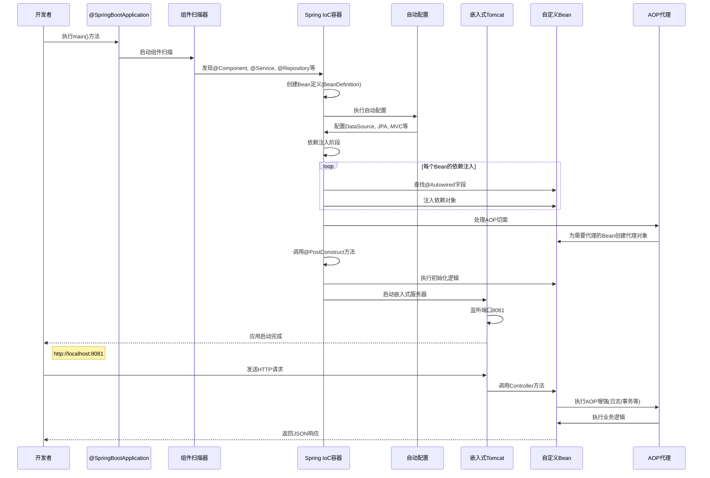

```mermaid
sequenceDiagram
    participant User as 开发者
    participant Main as @SpringBootApplication
    participant Scanner as 组件扫描器
    participant Container as Spring IoC容器
    participant Config as 自动配置
    participant Tomcat as 嵌入式Tomcat
    participant Bean as 自定义Bean
    participant AOP as AOP代理

    User->>Main: 执行main()方法
    Main->>Scanner: 启动组件扫描
    Scanner->>Container: 发现@Component, @Service, @Repository等
    Container->>Container: 创建Bean定义(BeanDefinition)

    Container->>Config: 执行自动配置
    Config->>Container: 配置DataSource, JPA, MVC等

    Container->>Container: 依赖注入阶段
    loop 每个Bean的依赖注入
        Container->>Bean: 查找@Autowired字段
        Container->>Bean: 注入依赖对象
    end

    Container->>AOP: 处理AOP切面
    AOP->>Bean: 为需要代理的Bean创建代理对象

    Container->>Container: 调用@PostConstruct方法
    Container->>Bean: 执行初始化逻辑

    Container->>Tomcat: 启动嵌入式服务器
    Tomcat->>Tomcat: 监听端口8081

    Tomcat-->>User: 应用启动完成
    Note right of User: http://localhost:8081

    User->>Tomcat: 发送HTTP请求
    Tomcat->>Bean: 调用Controller方法
    Bean->>AOP: 执行AOP增强(日志/事务等)
    AOP->>Bean: 执行业务逻辑
    Bean-->>User: 返回JSON响应
```